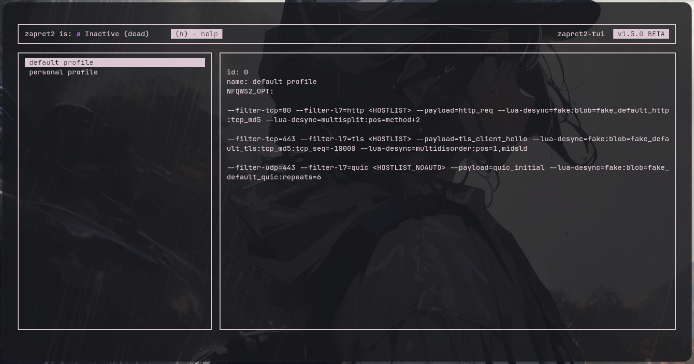

# zapret2-tui

> TUI-обёртка для [zapret2](https://github.com/bol-van/zapret2) — система обхода DPI на Linux

**[English version](README.md)**

<div align="center">
  <p align="center"></p>
</div>

## Что это

zapret2-tui — это текстовый интерфейс (TUI) для управления [zapret2](https://github.com/bol-van/zapret2). Программа не является отдельной версией zapret2, а является надстройкой над ней.

Основная идея: все стратегии обхода DPI разбиваются на **профили** для быстрого переключения. Каждый профиль — это своя стратегия.

## Как это работает

```
┌──────────────────────────────────────────────────────────────────┐
│                         zapret2-tui                              │
│                                                                  │
│  ┌─────────────────────┐     ┌───────────────────────────────┐   │
│  │   Конфиги приложения│     │      Конфиг zapret2           │   │
│  │   (буфер)           │     │      /opt/zapret2/config      │   │
│  │                     │     │                               │   │
│  │  ┌───────────────┐  │     │  ┌─────────────────────────┐  │   │
│  │  │ Профиль 1     │  │     │  │  АКТИВНЫЙ конфиг        │  │   │
│  │  │ (стратегия A) │──┼────>│  │  (скопирован из профиля)│  │   │
│  │  ├───────────────┤  │     │  └─────────────────────────┘  │   │
│  │  │ Профиль 2     │  │     │                               │   │
│  │  │ (стратегия B) │  │     └───────────────────────────────┘   │
│  │  ├───────────────┤  │                                         │
│  │  │ Профиль 3     │  │     ┌──────────────────────────────┐    │
│  │  │ (стратегия C) │  │     │   systemctl start/stop       │    │
│  │  └───────────────┘  │     │   zapret2.service            │    │
│  └─────────────────────┘     └──────────────────────────────┘    │
└──────────────────────────────────────────────────────────────────┘
```

### Принцип работы

1. **Хранение профилей**: Приложение хранит собственные копии конфига zapret2 с разными стратегиями. Каждый профиль — это полная копия конфига, но с другими значениями NFQWS2_OPT.

2. **Переключение профилей**: При выборе профиля приложение просто **копирует** сохранённый конфиг поверх основного конфига zapret2 (`/opt/zapret2/config`). Выбранный профиль выделяется **квадратными скобками** `[ ]` в интерфейсе.

3. **Управление сервисом**: Приложение может управлять сервисом zapret2 через systemctl:
   - `S` — запустить сервис
   - `X` — остановить сервис
   - `R` — перезапустить сервис

4. **Тестирование профилей** (опционально): Приложение может тестировать профили:
   - Создаёт iptables/nftables правило для NFQUEUE (очередь 2001)
   - Запускает nfqws2 с стратегией профиля
   - Отправляет HTTPS-запрос через очередь
   - Проверяет, применилась ли стратегия и доступен ли сайт

## Зависимости

- **[zapret2](https://github.com/bol-van/zapret2)** — основная система (обязательно)
- **Linux** с поддержкой NFQUEUE (ядро с модулем `nfnetlink_queue`)
- **ncurses** — для TUI интерфейса
- **OpenSSL** — для TLS-тестирования
- **libconfuse** — для чтения конфигов (собирается автоматически)
- **pthreads** — для многопоточного тестирования
- **root** — необходим для управления iptables/nftables и NFQUEUE``

### Автоматическая сборка зависимостей

При сборке автоматически скачиваются и компилируются:
- libconfuse (через FetchContent)
- ncurses (через ExternalProject)

## Первый запуск

```bash
sudo ./build/zapret2-tui
```

При первом запуске программа запросит:
1. Путь к папке zapret2 (например `/opt/zapret2`)
2. Выбор: продолжить или отредактировать `profiles.conf`

## Структура файлов

```
zapret2-tui/
├── config/
│   └── config              # Основной конфиг (автоматически)
├── profiles.conf           # Профили стратегий (создаётся вручную)
├── logs/
│   ├── zapret2-tui.log     # Логи приложения
│   └── testing.log         # Детальные логи тестирования
└── zapret2-tui             # Бинарник
```

## Управление

### Горячие клавиши

| Клавиша | Действие |
|---------|----------|
| `↑` / `↓` | Выбор профиля |
| `Enter` | Применить выбранный профиль |
| `S` | Запустить zapret2 |
| `X` | Остановить zapret2 |
| `R` | Перезапустить zapret2 |
| `T` | Тест текущего профиля |
| `A` | Тест всех профилей |
| `H` | Справка |
| `Q` / `Esc` | Выход |

### Статусы профилей

| Буква | Цвет | Значение |
|-------|------|----------|
| **S** | 🟢 зелёный | SUCCESS — стратегия работает |
| **P** | 🔵 бирюзовый | PARTIAL — сайт доступен, но desync не обнаружен |
| **F** | 🔴 красный | FAIL — стратегия не работает |
| **T** | 🟡 жёлтый | TESTING — идёт тест |
| **X** | 🟣 фиолетовый | ERROR — ошибка nfqws2 |

## Профили (profiles.conf)

```
testing {
  tables = "iptables"
  domain_test = "rutracker.org"
}

profile {
  id = 0
  name = "мой профиль"
  NFQWS2_OPT = "--filter-tcp=443 --filter-l7=tls --payload=tls_client_hello \
  --lua-desync=fake:blob=fake_default_tls:tcp_md5:tcp_seq=-10000 \
  --lua-desync=multidisorder:pos=1,midsld"
}
```

### Правила форматирования NFQWS2_OPT

- Перенос строки: обратный слэш `\` в конце строки
- Имена переменных: `<HOSTLIST>`, `<HOSTLIST_NOAUTO>`
- Стратегии separated через `--new`
- Допустимые lua-функции: `fake`, `multisplit`, `multidisorder`, `wssize`, `pktmod`, `send`

### Примеры стратегий

**Базовая (fake packet):**
```
--filter-tcp=443 --filter-l7=tls --payload=tls_client_hello \
--lua-desync=fake:blob=fake_default_tls:tcp_md5:tcp_seq=-10000
```

**Multisplit:**
```
--filter-tcp=443 --filter-l7=tls --payload=tls_client_hello \
--lua-desync=multisplit:pos=1,sniext+1,host+1,midsld
```

**Комбинированная:**
```
--filter-tcp=443 --filter-l7=tls --payload=tls_client_hello \
--lua-desync=fake:blob=fake_default_tls:tcp_md5:repeats=1 \
--lua-desync=multisplit:pos=1,sniext+1,host+1,midsld-2,midsld,midsld+2,endhost-1 \
--payload=empty --out-range=<s1 --lua-desync=send:tcp_md5
```

## Тестирование профилей

Программа может тестировать профили, отправляя HTTPS-запросы через NFQUEUE:

1. Создаётся iptables/nftables правило для очереди 2001
2. Запускается nfqws2 с указанным профилем
3. Отправляется HTTPS-запрос к тестовому домену
4. Анализируется результат: применилась ли стратегия, доступен ли сайт

### Результаты тестирования

| Статус | Значение |
|--------|----------|
| **SUCCESS** | Стратегия применилась, сайт доступен |
| **PARTIAL** | Сайт доступен, но стратегия не обнаружена (возможно, DPI не блокирует) |
| **FAIL** | Стратегия сломала соединение или не помогает |

## Логирование

Все действия логируются в два файла:

| Файл | Назначение |
|------|-----------|
| `./logs/zapret2-tui.log` | Общие логи приложения |
| `./logs/testing.log` | Детальные логи тестирования |

Формат логов:
```
[2026-06-19 09:20:19] [модуль] [УРОВЕНЬ]: сообщение
```

Уровни: `INFO`, `WARNING`, `ERROR`

## Архитектура

```
src/
├── main.c                    # Точка входа, chdir к директории программы
├── core/
│   ├── testing_profiles.c    # Логика тестирования профилей
│   ├── create_zapret_configs.c  # Генерация конфигов zapret
│   ├── create_link.c         # Применение профилей
│   ├── read_zapret_conf.c    # Чтение конфига zapret
│   └── first_start.c         # Мастер первого запуска
├── ui/
│   ├── app.c                 # Главный цикл приложения
│   ├── core.c                # Логика обработки действий
│   ├── ui.c                  # Отрисовка интерфейса
│   └── input.c               # Обработка ввода
└── utils/
    ├── log.c                 # Система логирования
    ├── readconf.c            # Чтение конфигов
    ├── writeconf.c           # Запись конфигов
    └── utils.c               # Утилиты
```


- [zapret2](https://github.com/bol-van/zapret2) — основная система обхода DPI
- [libconfuse](https://github.com/martinh/libconfuse) — библиотека для работы с конфигами
- ncurses — библиотека для TUI интерфейса
